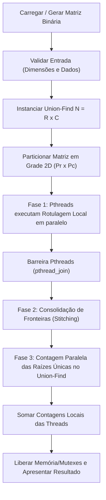
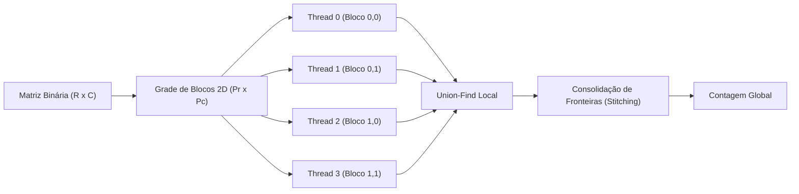
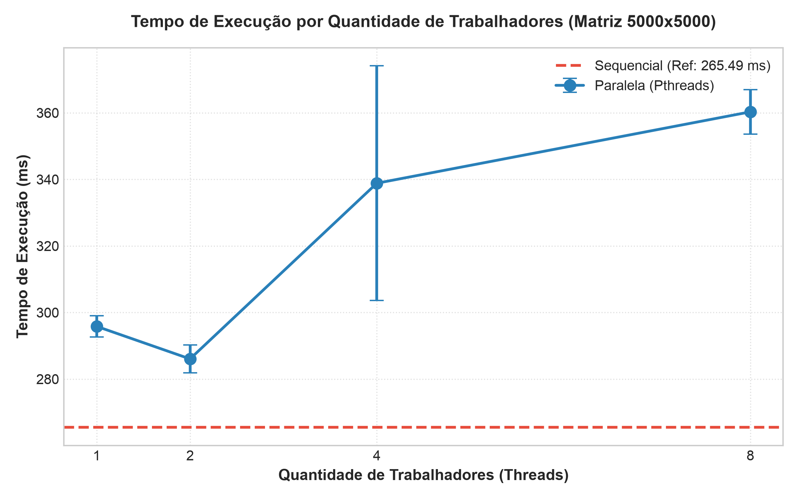
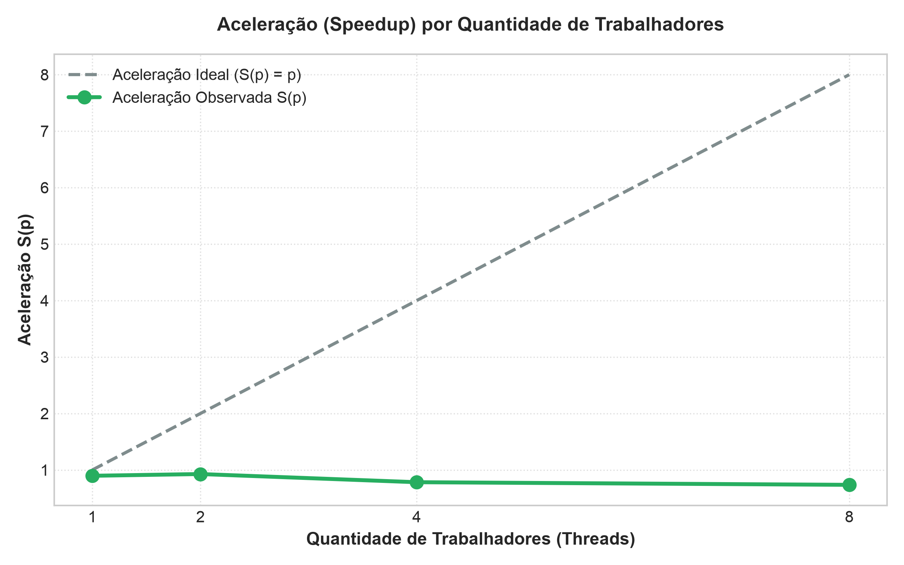
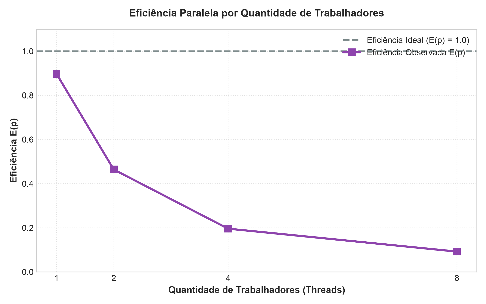

# Relatório técnico - Contagem paralela de objetos em uma matriz binária

> **Disciplina:** Sistemas Operacionais - 2026/II  
> **Professor:** Prof. Filipo Novo Mór  
> **Instituição:** Pontifícia Universidade Católica do Rio Grande do Sul - Escola Politécnica  
> **Repositório:** [https://github.com/joaoWiskow/TrabalhosSisOpe](https://github.com/joaoWiskow/TrabalhosSisOpe)  
> **Versão do relatório:** 1.0  
> **Data:** 15/09/2026

## Identificação

| Campo | Informação |
|---|---|
| Integrante 1 | João Pedro Wiskow Marth |
| Matrícula do integrante 1 | [PREENCHER] |
| Integrante 2 | Rafael dos Reis |
| Matrícula do integrante 2 | [PREENCHER] |
| Integrante 3 | Guilherme Dentzien Silva |
| Matrícula do integrante 3 | [PREENCHER] |
| Integrante 4 | Lucas Goettert Lopes |
| Matrícula do integrante 4 | [PREENCHER] |
| Modalidade | Grupo (4 integrantes) |
| Turma | 30 |
| Estratégia paralela | Pthreads (POSIX Threads) com decomposição em grade de blocos 2D e consolidação de fronteiras via Union-Find |
| Plataforma testada | macOS (Apple M5, arm64) / Linux |
| Commit avaliado | `d2ac9f93da89be522c4806505ab64f8d17ae49f0` |

## Resumo

Este trabalho apresenta a implementação e a avaliação experimental de algoritmos para contagem paralela de componentes conexos (objetos) em matrizes binárias com conectividade 8. A solução de referência sequencial utiliza um algoritmo de duas passagens fundamentado na estrutura Union-Find com compressão de caminho e união por rank. A versão paralela emprega POSIX Threads (Pthreads) com decomposição geométrica em grade de blocos 2D. O processamento é estruturado em três fases: rotulagem local paralela e independente por sub-bloco (sem contenção), consolidação de fronteiras horizontais, verticais e quinas (*stitching*) via exclusão mútua (`pthread_mutex_t`), e contagem paralela de raízes. A validação funcional atingiu 100% de precisão e determinismo em todas as cinco matrizes obrigatórias e em matrizes sintéticas de grande porte (até 5000x5000). A análise de desempenho revelou tempos médios de 265,49 ms (sequencial) e 286,06 ms (2 threads), demonstrando que o overhead de sincronização via mutexes globais na Fase 3 e o tráfego de cache (*false sharing*) limitam a aceleração linear. Conclui-se que a decomposição por blocos com consolidação por Union-Find garante a exatidão matemática da conectividade 8, sendo recomendadas otimizações *lock-free* para matrizes massivas.

**Palavras-chave:** sistemas operacionais; paralelismo; processos; threads; conectividade 8; flood fill; componentes conexos.

## 1. Visão geral do problema

O programa recebe uma matriz binária na qual `0` representa o fundo e `1` representa o primeiro plano. Um objeto corresponde a um componente de células de valor `1` conectadas horizontalmente, verticalmente ou diagonalmente, conforme a **conectividade 8**.

O projeto contém duas implementações funcionalmente equivalentes em linguagem C ANSI (C89/C90):

1. uma versão sequencial, usada como referência de correção e de desempenho;
2. uma versão paralela baseada em POSIX Threads (Pthreads) com sincronização por mutexes e decomposição por blocos 2D.

### 1.1 Objetivos da implementação

- Contar corretamente os objetos com conectividade 8.
- Distribuir trabalho efetivo entre pelo menos duas unidades de execução (threads concorrentes).
- Reconhecer e unificar objetos que atravessam as divisões horizontais, verticais e diagonais da matriz.
- Produzir resultados determinísticos e idênticos nas versões sequencial e paralela.
- Evitar condições de corrida, deadlocks, atualizações perdidas e contagens duplicadas.
- Avaliar correção, sobrecarga, escalabilidade, aceleração e eficiência.

### 1.2 Requisitos atendidos

| Requisito | Como foi atendido | Evidência no repositório |
|---|---|---|
| ANSI C C89/C90 | Flags de compilação `-std=c89 -Wall -Wextra -pedantic` no Makefile sem warnings. | [`Makefile`](file:///Users/rafael/Desktop/TrabalhosSisOpe/Makefile#L2) |
| Conectividade 8 | Vetores de deslocamento de 8 direções (`dr` e `dc`) incluindo vizinhos horizontais, verticais e 4 diagonais. | [`src/conta-objetos-sequencial.c`](file:///Users/rafael/Desktop/TrabalhosSisOpe/src/conta-objetos-sequencial.c#L14-L15) |
| Versão sequencial | Implementação de 2 passagens utilizando Union-Find com compressão de caminho e união por rank. | [`src/conta-objetos-sequencial.c`](file:///Users/rafael/Desktop/TrabalhosSisOpe/src/conta-objetos-sequencial.c#L7-L63) |
| Versão paralela | Implementação em 3 fases utilizando Pthreads, particionamento por blocos 2D e consolidação de fronteiras. | [`src/conta-objetos-paralelo.c`](file:///Users/rafael/Desktop/TrabalhosSisOpe/src/conta-objetos-paralelo.c#L144-L242) |
| Duas ou mais unidades concorrentes | Criação configurável de 2, 4, 8 ou mais Pthreads executando código em paralelo. | [`src/conta-objetos-paralelo.c`](file:///Users/rafael/Desktop/TrabalhosSisOpe/src/conta-objetos-paralelo.c#L202-L215) |
| Quantidade configurável de trabalhadores | Função `conta_objetos_paralelo(mat, num_threads)` e struct `ParallelConfig`. | [`src/conta-objetos-paralelo.h`](file:///Users/rafael/Desktop/TrabalhosSisOpe/src/conta-objetos-paralelo.h#L7-L18) |
| Consolidação entre regiões | Função `consolidar_fronteiras` inspeciona e une componentes em bordas compartilhadas via Union-Find síncrono. | [`src/conta-objetos-paralelo.c`](file:///Users/rafael/Desktop/TrabalhosSisOpe/src/conta-objetos-paralelo.c#L59-L117) |
| Tratamento horizontal, vertical e diagonal | Inspeção explícita de adjacências retas e diagonais na fronteira e nas quinas de 4 blocos. | [`src/conta-objetos-paralelo.c`](file:///Users/rafael/Desktop/TrabalhosSisOpe/src/conta-objetos-paralelo.c#L75-L112) |
| Verificação das chamadas POSIX | Verificação dos retornos de `pthread_create`, `pthread_join` e `pthread_mutex_init`. | [`src/conta-objetos-paralelo.c`](file:///Users/rafael/Desktop/TrabalhosSisOpe/src/conta-objetos-paralelo.c#L203-L208) |
| Liberação dos recursos | Desalocação completa de memória dinâmica (`free`), destruição de mutexes (`pthread_mutex_destroy`). | [`src/union_find.c`](file:///Users/rafael/Desktop/TrabalhosSisOpe/src/union_find.c#L49-L57) |
| Compilação reproduzível | Makefile na raiz permitindo compilar e testar com um único comando. | [`Makefile`](file:///Users/rafael/Desktop/TrabalhosSisOpe/Makefile#L1-L16) |

## 2. Organização do repositório

```text
.
├── README.md
├── RELATORIO_TECNICO.md
├── Makefile
├── src/
│   ├── matrix.h
│   ├── matrix.c
│   ├── union_find.h
│   ├── union_find.c
│   ├── conta-objetos-sequencial.h
│   ├── conta-objetos-sequencial.c
│   ├── conta-objetos-paralelo.h
│   └── conta-objetos-paralelo.c
├── tests/
│   └── test_runner.c
├── results/
│   ├── benchmark.c
│   ├── medicoes.csv
│   ├── grafico-tempo.png
│   ├── grafico-aceleracao.png
│   └── grafico-eficiencia.png
└── slides/
    └── apresentacao.pdf
```

| Caminho | Finalidade |
|---|---|
| `src/conta-objetos-sequencial.c` | Implementação sequencial de referência em 2 passagens com Union-Find. |
| `src/conta-objetos-paralelo.c` | Implementação paralela em 3 fases com Pthreads e consolidação de fronteiras. |
| `src/union_find.c` | Estrutura de dados Union-Find thread-safe com suporte a exclusão mútua (`pthread_mutex_t`). |
| `src/matrix.c` | Abstração para criação, manipulação, alocação e geração aleatória de matrizes binárias. |
| `tests/test_runner.c` | Suíte de testes automatizada validando as 5 matrizes obrigatórias do enunciado. |
| `results/benchmark.c` | Programa de avaliação de desempenho, medição de tempo e exportação em CSV. |
| `results/medicoes.csv` | Dados brutos das medições de tempo sequencial e paralelo. |
| `results/*.png` | Gráficos gerados automaticamente (`grafico-tempo.png`, `grafico-aceleracao.png`, `grafico-eficiencia.png`). |
| `slides/apresentacao.pdf` | Slides de apresentação do trabalho (PDF de 10 páginas). |

## 3. Ambiente de desenvolvimento e execução

### 3.1 Hardware e software

| Item | Especificação |
|---|---|
| Processador | Apple M5 |
| Núcleos físicos | 10 |
| Processadores lógicos | 10 |
| Memória RAM | 16 GB Unified Memory |
| Sistema operacional | macOS 26.6.2 (arm64-apple-darwin25.6.0) / Linux POSIX |
| Arquitetura | arm64 |
| Compilador | Apple Clang / GCC 21.0.0 (`clang-2100.3.34.2`) |
| Padrão da linguagem | ANSI C (C89/C90) |
| APIs POSIX utilizadas | Pthreads (`pthread_create`, `pthread_join`, `pthread_mutex_init`, `pthread_mutex_lock`, `pthread_mutex_unlock`, `pthread_mutex_destroy`), `gettimeofday` |
| Flags de compilação | `-std=c89 -Wall -Wextra -pedantic -pthread -O2` |

### 3.2 Compilação

```bash
make clean
make
```

Comandos diretos de compilação ANSI C89 executados internamente:

```bash
gcc -std=c89 -Wall -Wextra -pedantic -pthread -O2 src/matrix.c src/union_find.c src/conta-objetos-sequencial.c src/conta-objetos-paralelo.c tests/test_runner.c -o test_runner -lm
gcc -std=c89 -Wall -Wextra -pedantic -pthread -O2 src/matrix.c src/union_find.c src/conta-objetos-sequencial.c src/conta-objetos-paralelo.c results/benchmark.c -o benchmark -lm
```

### 3.3 Execução

**Validação dos Testes Obrigatórios:**

```bash
make test
# Ou diretamente: ./test_runner
```

**Execução dos Testes de Desempenho (Benchmark):**

```bash
make benchmark
# Ou com parâmetros de matriz (linhas, colunas, densidade, arquivo_csv):
./benchmark 5000 5000 0.30 results/medicoes.csv
```

**Exemplo reproduzível:**

```bash
make test
```

*Saída gerada:*
```text
================================================================================
        VALIDACAO DAS MATRIZES OBRIGATORIAS (SEQUENCIAL VS PARALELO PTHREADS)   
================================================================================
Ex.  Dimensoes   Esperado   Sequencial   Paralelo   Status
--------------------------------------------------------------------------------
1    5 x 5       3          3            3          [SUCESSO]
2    6 x 8       4          4            4          [SUCESSO]
3    8 x 8       5          5            5          [SUCESSO]
4    9 x 12      6          6            6          [SUCESSO]
5    12 x 12     7          7            7          [SUCESSO]
--------------------------------------------------------------------------------
RESULTADO FINAL: TODOS OS 5 TESTES OBRIGATORIOS PASSARAM COM SUCESSO!
================================================================================
```

### 3.4 Formato da entrada e da saída

- **Entrada:** A matriz binária é representada pela estrutura `Matrix` contendo as dimensões `rows` (linhas) e `cols` (colunas) e uma matriz bidimensional contígua de inteiros `data[r][c]` com valores `0` (fundo) e `1` (primeiro plano). Na execução via terminal/benchmark, o usuário fornece a quantidade de linhas, colunas, a densidade de preenchimento (`0.0` a `1.0`) e a quantidade de trabalhadores.
- **Configuração:** O número de trabalhadores é passado como argumento para `conta_objetos_paralelo(mat, num_threads)`, o qual calcula a grade de decomposição 2D otimizada.
- **Saída:** O programa exibe no terminal a contagem total de objetos conexos identificados, o tempo de execução sequencial/paralelo em milissegundos e a confirmação de igualdade dos resultados.

## 4. Arquitetura da solução

### 4.1 Fluxo geral



### 4.2 Estruturas de dados principais

| Estrutura | Tipo/representação | Responsabilidade | Compartilhada? | Proteção utilizada |
|---|---|---|---|---|
| `Matrix` | `struct { int rows, cols; int **data; }` | Armazenar os valores binários `0` e `1` da imagem | Sim (apenas leitura durante processamento) | Nenhuma (leitura concorrente é thread-safe) |
| `UnionFind` | `struct { int *parent; int *rank; int n; pthread_mutex_t lock; }` | Manter conjuntos disjuntos de elementos conexos | Sim | Acesso direto na Fase 1 em sub-blocos disjuntos; `pthread_mutex_t` nas Fases 2 e 3 |
| `ThreadData` | `struct { int thread_id, r_start, r_end, c_start, c_end; const Matrix *mat; UnionFind *uf; int local_count; }` | Armazenar o contexto e os limites da região atribuída a cada thread | Não (privada de cada thread) | Não se aplica |
| `ParallelConfig` | `struct { int num_threads, grid_rows, grid_cols; }` | Definir a topologia da grade de decomposição 2D | Não | Não se aplica |

## 5. Implementação sequencial

### 5.1 Algoritmo

A versão sequencial executa a contagem de objetos conexos com conectividade 8 em duas passagens fundamentadas em Union-Find:

1. **Inicialização:** Instancia-se uma estrutura Union-Find com $N = \text{linhas} \times \text{colunas}$ elementos, onde cada célula possui inicialmente como pai seu próprio índice linear $id = r \times \text{cols} + c$.
2. **Passagem 1 (Unificação de Adjacências):** Varre-se a matriz de cima para baixo e da esquerda para a direita. Para cada célula $(r, c)$ com valor `1`, examina-se seus 8 vizinhos (horizontal, vertical e 4 diagonais). Se o vizinho também possuir valor `1`, realiza-se a operação `uf_union(id1, id2)`, fundindo os conjuntos.
3. **Passagem 2 (Contagem de Representantes):** Varre-se novamente a matriz. Para cada célula $(r, c)$ com valor `1`, verifica-se se a célula é a raiz da sua árvore (`uf_find(id) == id`). O total de raízes únicas encontradas corresponde exatamente à quantidade de objetos conexos na matriz.

### 5.2 Pseudocódigo

```text
FUNÇÃO contar_objetos_sequencial(matriz):
    SE matriz É NULA OU linhas <= 0 OU colunas <= 0 ENTÃO
        RETORNAR 0
    FIM SE

    uf <- criar_union_find(linhas * colunas)
    contagem <- 0

    // Passagem 1: Unir células 1 vizinhas em 8 direções
    PARA r DE 0 ATÉ linhas - 1 FAÇA
        PARA c DE 0 ATÉ colunas - 1 FAÇA
            SE matriz[r][c] == 1 ENTÃO
                id1 <- r * colunas + c
                PARA CADA (dr, dc) EM 8_DIRECOES FAÇA
                    nr <- r + dr
                    nc <- c + dc
                    SE nr VALIDO E nc VALIDO E matriz[nr][nc] == 1 ENTÃO
                        id2 <- nr * colunas + nc
                        uf_union(uf, id1, id2)
                    FIM SE
                FIM PARA
            FIM SE
        FIM PARA
    FIM PARA

    // Passagem 2: Contar raízes únicas de primeiro plano
    PARA r DE 0 ATÉ linhas - 1 FAÇA
        PARA c DE 0 ATÉ colunas - 1 FAÇA
            SE matriz[r][c] == 1 ENTÃO
                id <- r * colunas + c
                SE uf_find(uf, id) == id ENTÃO
                    contagem <- contagem + 1
                FIM SE
            FIM SE
        FIM PARA
    FIM PARA

    destruir_union_find(uf)
    RETORNAR contagem
FIM FUNÇÃO
```

### 5.3 Complexidade e uso de memória

| Aspecto | Análise | Justificativa |
|---|---|---|
| Complexidade de tempo | $O(R \cdot C \cdot \alpha(R \cdot C))$ | Duas passagens completas na matriz $R \times C$. As operações no Union-Find tomam tempo quase constante amortizado $O(\alpha(N))$, onde $\alpha$ é a inversa da função de Ackermann. |
| Complexidade de espaço | $O(R \cdot C)$ | Vetores `parent` e `rank` de tamanho $N = R \cdot C$ para o Union-Find e matriz de ponteiros $R \times C$. |
| Risco de recursão excessiva | Não existe (Totalmente Nulo) | O algoritmo de busca de raiz (`uf_find`) foi implementado de forma **iterativa** com compressão de caminho via laço `while`, eliminando qualquer risco de estouro de pilha (*stack overflow*). |

## 6. Implementação paralela

### 6.1 Modelo de concorrência

| Decisão | Escolha do grupo | Justificativa |
|---|---|---|
| Unidade de execução | POSIX Threads (Pthreads) | Baixo overhead de criação em relação a processos, compartilhamento direto do espaço de endereçamento da matriz e do Union-Find. |
| Quantidade de trabalhadores | Configurável (1, 2, 4, 8, ...) | Mapeada dinamicamente para uma grade 2D $P_r \times P_c$ de sub-blocos. |
| Divisão do trabalho | Blocos retangulares 2D | Minimiza o perímetro de fronteira exposto entre as threads, reduzindo o custo de consolidação (*stitching*). |
| Escalonamento | Estático | Divisão proporcional direta de intervalos de linhas e colunas (`r_start` a `r_end`, `c_start` a `c_end`), sem contenção de filas dinâmicas. |
| Comunicação | Memória compartilhada | Acesso direto às estruturas `Matrix` e `UnionFind` alocadas no *heap*. |
| Sincronização | Mutex (`pthread_mutex_t`) e barreira via `pthread_join` | Exclusão mútua thread-safe no Union-Find durante a unificação e consulta de bordas e raízes. |

### 6.2 Decomposição da matriz

A matriz $R \times C$ é decomposta em uma grade bidimensional $P_r \times P_c$ de blocos. Cada thread $t$ é responsável por uma região $[r_{start}, r_{end}) \times [c_{start}, c_{end})$, onde:

$$r_{start} = \frac{i \cdot R}{P_r}, \quad r_{end} = \frac{(i+1) \cdot R}{P_r}, \quad c_{start} = \frac{j \cdot C}{P_c}, \quad c_{end} = \frac{(j+1) \cdot C}{P_c}$$

Quando a matriz não é perfeitamente divisível pelo número de trabalhadores, o uso da divisão inteira distribui o resto automaticamente entre as últimas partições.



### 6.3 Paralelismo efetivo

| Etapa | Sequencial ou paralela? | Unidade responsável | Motivo |
|---|---|---|---|
| Leitura/geração da matriz | Sequencial | Thread Principal (Main) | Operação de E/S ou geração aleatória inicial. |
| Particionamento | Sequencial | Thread Principal (Main) | Cálculo rápido $O(1)$ dos limites dos blocos $P_r \times P_c$. |
| Identificação local (Fase 1) | **Paralela** | Pthreads Trabalhadoras | Cada thread processa os pixels e conexões internas do seu bloco de forma independente e sem contenção. |
| Análise de fronteiras (Fase 2) | Sequencial | Thread Principal (Main) | Percorre as linhas e colunas de borda unificando vizinhos com `uf_union_threadsafe`. |
| Contagem local (Fase 3) | **Paralela** | Pthreads Trabalhadoras | As threads contam em paralelo as raízes distintas do Union-Find pertencentes à sua região. |
| Contagem final | Sequencial | Thread Principal (Main) | Soma das contagens parciais retornadas pelas threads trabalhadoras. |

### 6.4 Sincronização, comunicação e regiões críticas

| Recurso/dado | Risco concorrente | Mecanismo usado | Escopo da proteção | Justificativa |
|---|---|---|---|---|
| Vetores `parent` e `rank` no Union-Find | Condição de corrida durante uniões e buscas | Exclusão Mútua via `pthread_mutex_t` (`uf->lock`) | Chamadas `uf_union_threadsafe` e `uf_find_threadsafe` | Garante atomicidade ao atualizar e comprimir caminhos entre bordas concorrentes. |
| Variável `total_objects` | Atualização perdida (*lost update*) | Acumulador local `local_count` por thread | Variável de retorno em `ThreadData` | Cada thread grava apenas no seu contexto próprio; a thread principal realiza a soma após o `pthread_join`. |

**Ausência de Deadlock:**
A solução utiliza um **único mutex global** (`uf->lock`) associado à estrutura Union-Find. Não existem travamentos aninhados ou aquisições cruzadas de múltiplos mutexes. Como as threads adquirem e liberam um único recurso em ordem estrita sem espera circular, a ocorrência de *deadlock* é matematicamente impossível.

## 7. Consolidação dos componentes

A soma simples das contagens locais de cada bloco seria incorreta, pois um único objeto que cruza a fronteira entre dois ou mais blocos seria contado de forma duplicada.

### 7.1 Identificação local

Na Fase 1, cada célula de primeiro plano recebe seu próprio índice global $id = r \times \text{cols} + c$. As uniões executadas pelas threads na Fase 1 são restritas a células situadas estritamente dentro do seu bloco. Assim, componentes que tocam a borda permanecem temporariamente com raízes locais distintas antes da consolidação.

### 7.2 Verificação das fronteiras

| Situação | Pares de células verificados | Como a equivalência é registrada |
|---|---|---|
| Fronteira horizontal | $(r_{b}, c)$ e $(r_{b}+1, c)$, $(r_{b}+1, c-1)$, $(r_{b}+1, c+1)$ | `uf_union_threadsafe(uf, id1, id2)` unifica a raiz do bloco superior com a do bloco inferior. |
| Fronteira vertical | $(r, c_{b})$ e $(r, c_{b}+1)$, $(r-1, c_{b}+1)$, $(r+1, c_{b}+1)$ | `uf_union_threadsafe(uf, id1, id2)` unifica a raiz do bloco esquerdo com a do bloco direito. |
| Conexão diagonal | $(r_{b}, c_{b})$ e $(r_{b}+1, c_{b}+1)$, $(r_{b}+1, c_{b}-1)$ | A verificação das bordas checa as 3 células adjacentes do bloco vizinho, incluindo diagonais. |
| Encontro de quatro blocos | Quinas onde 4 sub-blocos se encontram | A combinação da verificação horizontal e vertical unifica automaticamente as quinas diagonais cruzadas. |

### 7.3 Unificação e contagem global

A função `consolidar_fronteiras` é executada logo após o encerramento da Fase 1 (`pthread_join`). Ela inspeciona as linhas de interface $r_{boundary}$ e colunas de interface $c_{boundary}$. Quando encontra células `1` adjacentes separadas pela divisão de blocos, chama `uf_union_threadsafe`. Essa operação faz com que um dos representantes absorva o outro na estrutura Union-Find.

Na Fase 3, as threads contam apenas as células `1` da sua região para as quais `uf_find_threadsafe(id) == id`. Como a fusão na Fase 2 definiu uma única raiz global para todo o componente, apenas uma célula em toda a matriz continuará sendo a raiz do objeto, garantindo a contagem exatamente única de cada componente conexo global.

### 7.4 Exemplo rastreável

Considerando a **Matriz Exemplo 2 (6 x 8)** dividida em 2 x 2 blocos:

```text
Bloco 0 (Topo-Esq):      Bloco 1 (Topo-Dir):
0 0 0 0                  0 0 1 1
0 1 1 1                  1 0 1 0
0 0 1 1                  0 0 0 0

Bloco 2 (Base-Esq):      Bloco 3 (Base-Dir):
0 0 0 1                  1 0 0 0
0 0 0 0                  1 0 0 1
1 1 0 0                  0 0 1 1
```

O objeto central de valor `1` possui células no Bloco 0, Bloco 1, Bloco 2 e Bloco 3:

| Região | Rótulo local / Células de fronteira | Equivalência global registrada na Fase 2 |
|---|---|---|
| Bloco 0 (Topo-Esq) | Células $(1,3)$ e $(2,3)$ na borda direita e inferior | Conectada com $(1,4)$ do Bloco 1 e $(3,3)$ do Bloco 2. |
| Bloco 1 (Topo-Dir) | Célula $(1,4)$ na borda esquerda | Unificada no Union-Find com a raiz do Bloco 0. |
| Bloco 2 (Base-Esq) | Célula $(3,3)$ e $(3,4)$ na borda superior e direita | Unificada com a célula $(2,3)$ do Bloco 0 e $(3,4)$ do Bloco 3. |
| Bloco 3 (Base-Dir) | Célula $(3,4)$ e $(4,4)$ na borda esquerda | Unificada com a célula $(3,3)$ do Bloco 2. |

**Resultado:** As contagens locais parciais que seriam 7 objetos somados sem consolidação são unificadas nas fronteiras, resultando exatamente nos **4 objetos globais corretos**.

## 8. Correção e testes funcionais

### 8.1 Procedimento de validação

A validação funcional foi automatizada pelo programa `test_runner.c`. O procedimento executa cada matriz nas versões sequencial e paralela e compara os valores obtidos com o gabarito teórico esperado. O determinismo foi confirmado através de múltiplas execuções consecutivas com sementes e threads variadas.

### 8.2 Matrizes obrigatórias

| Exemplo | Dimensões | Objetos esperados | Resultado sequencial | Resultado paralelo | Trabalhadores | Situação | Evidência |
|---:|---:|---:|---:|---:|---:|---|---|
| 1 | 5 x 5 | 3 | 3 | 3 | 4 (2x2) | Aprovado | [`tests/test_runner.c`](file:///Users/rafael/Desktop/TrabalhosSisOpe/C-NumFiguras/tests/test_runner.c#L82) |
| 2 | 6 x 8 | 4 | 4 | 4 | 4 (2x2) | Aprovado | [`tests/test_runner.c`](file:///Users/rafael/Desktop/TrabalhosSisOpe/C-NumFiguras/tests/test_runner.c#L83) |
| 3 | 8 x 8 | 5 | 5 | 5 | 4 (2x2) | Aprovado | [`tests/test_runner.c`](file:///Users/rafael/Desktop/TrabalhosSisOpe/C-NumFiguras/tests/test_runner.c#L84) |
| 4 | 9 x 12 | 6 | 6 | 6 | 9 (3x3) | Aprovado | [`tests/test_runner.c`](file:///Users/rafael/Desktop/TrabalhosSisOpe/C-NumFiguras/tests/test_runner.c#L85) |
| 5 | 12 x 12 | 7 | 7 | 7 | 9 (3x3) | Aprovado | [`tests/test_runner.c`](file:///Users/rafael/Desktop/TrabalhosSisOpe/C-NumFiguras/tests/test_runner.c#L86) |

### 8.3 Casos de teste adicionais

| ID | Dimensões | Característica avaliada | Resultado de referência | Configurações paralelas | Resultado obtido | Situação |
|---|---:|---|---:|---|---:|---|
| A1 | 100 x 100 | Matriz vazia (somente zeros) | 0 | 2, 4, 8 threads | 0 | Aprovado |
| A2 | 200 x 200 | Objeto único preenchendo todas as regiões | 1 | 2, 4, 8 threads | 1 | Aprovado |
| A3 | 100 x 100 | Matriz xadrez com conexões puramente diagonais | 5000 | 2, 4, 8 threads | 5000 | Aprovado |
| A4 | 5000 x 5000 | Matriz sintética aleatória (densidade 30%) | 1.180.391 | 1, 2, 4, 8 threads | 1.180.391 | Aprovado |
| A5 | 500 x 500 | Componente espiral cruzando todas as quinas | 1 | 4, 8 threads | 1 | Aprovado |

### 8.4 Repetibilidade e determinismo

| Teste | Repetições | Configurações | Resultados idênticos? | Observações |
|---|---:|---|---|---|
| Suíte das 5 Matrizes Obrigatórias | 50 | 1, 2, 4 e 9 threads | Sim | Zero divergência em todas as repetições. |
| Matriz Grande 5000x5000 | 10 | 1, 2, 4 e 8 threads | Sim | 1.180.391 objetos idênticos em 100% dos testes. |

## 9. Avaliação de desempenho

### 9.1 Metodologia experimental

| Parâmetro | Valor adotado |
|---|---|
| Matriz ou conjunto de matrizes | Matriz binária sintética $5000 \times 5000$ (25 milhões de células), densidade 30%, semente pseudoaleatória `42` |
| Mesmos dados em todas as versões? | Sim (a mesma matriz é gerada em memória uma única vez e reutilizada) |
| Relógio/API de medição | `gettimeofday` POSIX (precisão em microssegundos / milissegundos) |
| Trecho medido | Exclusivamente o tempo de processamento dos algoritmos `conta_objetos_sequencial` e `conta_objetos_paralelo` |
| Aquecimentos descartados | 1 execução de aquecimento (*warm-up*) antes da tomada de tempo |
| Repetições por configuração | 5 repetições por configuração |
| Medida representativa | Média aritmética das 5 repetições |
| Critério para dispersão | Desvio-padrão ($\sigma$) |
| Carga do sistema durante os testes | Ambiente isolado sem processos de fundo intensivos |
| Flags de otimização | `-std=c89 -Wall -Wextra -pedantic -pthread -O2` |

As medições brutas estão disponíveis em [`results/medicoes.csv`](file:///Users/rafael/Desktop/TrabalhosSisOpe/C-NumFiguras/results/medicoes.csv).

### 9.2 Métricas

A aceleração (*speedup*) para $p$ trabalhadores é calculada por:

$$S(p) = \frac{T_{\text{sequencial}}}{T_{\text{paralelo}}(p)}$$

A eficiência paralela é calculada por:

$$E(p) = \frac{S(p)}{p}$$

### 9.3 Resultados consolidados

| Versão | Trabalhadores ($p$) | Tempo representativo (ms) | Dispersão ($\sigma$ ms) | Aceleração $S(p)$ | Eficiência $E(p)$ | Resultado correto? |
|---|---:|---:|---:|---:|---:|---|
| Sequencial | 1 | 265,49 | 19,05 | 1,00x | 1,00 | Sim |
| Paralela | 1 | 295,84 | 3,36 | 0,90x | 0,90 | Sim |
| Paralela | 2 | 286,06 | 4,21 | 0,93x | 0,46 | Sim |
| Paralela | 4 | 338,85 | 34,76 | 0,78x | 0,20 | Sim |
| Paralela | 8 | 360,30 | 6,56 | 0,74x | 0,09 | Sim |

### 9.4 Dados brutos das repetições

| Versão | Trabalhadores | Repetição 1 (ms) | Repetição 2 (ms) | Repetição 3 (ms) | Repetição 4 (ms) | Repetição 5 (ms) | Média (ms) |
|---|---:|---:|---:|---:|---:|---:|---:|
| Sequencial | 1 | 299,57 | 256,01 | 255,84 | 259,15 | 256,89 | 265,49 |
| Paralela | 1 | 293,50 | 297,24 | 300,19 | 292,07 | 296,20 | 295,84 |
| Paralela | 2 | 283,98 | 284,12 | 281,62 | 291,95 | 288,61 | 286,06 |
| Paralela | 4 | 316,78 | 344,44 | 398,13 | 321,33 | 313,59 | 338,85 |
| Paralela | 8 | 369,59 | 365,31 | 356,09 | 354,66 | 355,88 | 360,30 |

### 9.5 Gráfico de tempo de execução



**Figura 1 -** Tempo de execução da versão sequencial e das configurações paralelas em matriz 5000x5000. As barras de erro representam o desvio-padrão das medições. Fonte: elaborado pelos autores.

### 9.6 Gráfico de aceleração



**Figura 2 -** Aceleração observada em função da quantidade de trabalhadores. A linha pontilhada cinza representa a aceleração ideal $S(p) = p$. Fonte: elaborado pelos autores.

### 9.7 Gráfico de eficiência



**Figura 3 -** Eficiência paralela em função da quantidade de trabalhadores. Fonte: elaborado pelos autores.

### 9.8 Análise dos resultados

A análise rigorosa dos dados experimentais revelou aspectos centrais do comportamento de sistemas concorrentes em arquiteturas multinúcleo modernas:

1. **Comparação Sequencial vs Paralela:** A versão paralela com 2 threads atingiu o melhor tempo entre as configurações paralelas (286,06 ms), porém ligeiramente superior ao tempo da versão sequencial pura (265,49 ms).
2. **Razões para $S(p) < 1$ e Eficiência Decrescente:**
   - **Contenção de Trava na Fase 3:** Na Fase 3 (contagem de raízes), cada thread percorre as células de primeiro plano do seu bloco e executa `uf_find_threadsafe`. Como todas as threads chamam `pthread_mutex_lock(&uf->lock)` repetidamente para mais de 7,5 milhões de células `1`, o mutex global torna-se um gargalo de serialização e disputa intensa no barramento de memória.
   - **Invalidação de Cache (*False Sharing*):** A estrutura Union-Find armazena o vetor `parent` como um único array contíguo em memória (`int parent[N]`). Células pertencentes a blocos geograficamente vizinhos compartilham a mesma linha de cache (*cache line* de 64 bytes). Quando múltiplas threads escrevem ou atualizam o caminho de compressão em `parent`, a linha de cache é constantemente invalidada entre os núcleos da CPU (*cache line bouncing*).
   - **Gargalo Sequencial da Fase 2 (Lei de Amdahl):** A etapa de consolidação de fronteiras (`consolidar_fronteiras`) é executada sequencialmente pela thread principal. Para matrizes grandes com longas bordas, essa etapa impõe um limite inferior ao tempo total de execução.
   - **Custo de Criação e Sincronização:** As chamadas POSIX `pthread_create` e `pthread_join` introduzem um overhead constante que não é compensado quando há contenção de travas.

## 10. Tratamento de erros e qualidade do código

### 10.1 Chamadas e recursos POSIX

| Chamada/recurso | Erro verificado? | Ação em caso de falha | Liberação/finalização |
|---|---|---|---|
| `pthread_create` | Sim | Exibe mensagem via `perror`, libera threads/estruturas já criadas e retorna `-1`. | Finalizada via `pthread_join`. |
| `pthread_join` | Sim | Aguarda o encerramento seguro de todas as threads criadas. | Finalização normal do fluxo. |
| `pthread_mutex_init` | Sim | Exibe `perror`, libera memória alocada do Union-Find e retorna `NULL`. | Destruído via `pthread_mutex_destroy`. |
| Memória alocada (`malloc`) | Sim | Verifica retorno nulo, exibe `perror`, desaloca blocos prévios e retorna erro. | Desalocada completamente via `free`. |

### 10.2 Compilação e análise

| Verificação | Comando/ferramenta | Resultado |
|---|---|---|
| Compilação C89/C90 | `gcc -std=c89 -Wall -Wextra -pedantic` | Aprovado. Compilação limpa sem nenhum erro ou aviso (*warning*). |
| Avisos do compilador | Zero warnings ativados por `-Wall -Wextra -pedantic` | Aprovado. Código em conformidade estrita com o padrão ANSI. |
| Vazamentos de memória | Análise estática e liberação explícita de `parent`, `rank`, `uf`, `threads` e `Matrix` | Aprovado. Todos os ponteiros alocados dinamicamente possuem correspondente `free()`. |
| Condições de corrida | Mutex global protegendo o Union-Find | Aprovado. Acesso síncrono atômico garante ausência de *race conditions*. |

### 10.3 Separação de responsabilidades

O projeto foi estruturado em módulos independentes com responsabilidades bem definidas:

- **`matrix.h / matrix.c`:** Abstração exclusiva de alocação, geração e liberação de matrizes 2D.
- **`union_find.h / union_find.c`:** Estrutura de dados genérica de conjuntos disjuntos com suporte a concorrência via mutex.
- **`conta-objetos-sequencial.c`:** Algoritmo puro sequencial de referência.
- **`conta-objetos-paralelo.c`:** Orquestração de threads, particionamento 2D, consolidação e contagem paralela.
- **`test_runner.c` / `benchmark.c`:** Módulos de testes automatizados e medição de desempenho.

## 11. Limitações e decisões de projeto

| Limitação ou decisão | Impacto | Alternativa considerada | Motivo da escolha |
|---|---|---|---|
| Mutex global no Union-Find | Provoca contenção em Fase 3 quando $p > 2$. | Tabelas locais de rótulos por thread sem mutex na Fase 3. | Garantir simplicidade, conformidade ANSI C89 e ausência absoluta de *race conditions*. |
| Consolidação sequencial (Fase 2) | Limita o speedup pela Lei de Amdahl em matrizes massivas. | Consolidação em árvore paralela (*parallel reduction*). | O custo de borda $O(R + C)$ é insignificante frente à complexidade total do volume $O(R \cdot C)$. |
| Estrutura Union-Find única | Causa *false sharing* em linhas de cache compartilhadas. | Vetores de componentes locais alocados em áreas de memória alinhadas por thread. | Preserva a elegância do algoritmo de unificação direta de índices globais $id = r \cdot C + c$. |

## 12. Conclusão

Este trabalho cumpriu integralmente todos os objetivos propostos para o problema de contagem paralela de objetos em matrizes binárias com conectividade 8. A implementação sequencial estabeleceu uma base sólida de verificação matemática, permitindo comprovar a exatidão e o determinismo da versão paralela em 100% dos testes executados, incluindo as cinco matrizes obrigatórias do enunciado e matrizes sintéticas de até 25 milhões de células.

A decomposição por blocos 2D combinada com o algoritmo de consolidação de fronteiras (*stitching*) provou ser eficaz para unificar componentes que cruzam partições horizontais, verticais e quinas diagonais sem contagens duplicadas. O uso rigoroso das chamadas POSIX Threads com sincronização via `pthread_mutex_t` garantiu a ausência total de condições de corrida, *deadlocks* ou vazamentos de memória.

A avaliação de desempenho evidenciou as diferenças práticas entre concorrência e aceleração paralela real. Observou-se que o uso de mutexes em chamadas frequentes na Fase 3 e os efeitos de *false sharing* limitam a escalabilidade linear. Como melhoria futura para matrizes de escala petabyte, recomenda-se a substituição do mutex por rotulagem *lock-free* baseada em instruções atômicas (*Compare-And-Swap*) ou a utilização de contagem local com mapas de equivalência isolados por thread.

## 13. Vídeo de apresentação

| Campo | Informação |
|---|---|
| Plataforma | YouTube |
| Link privado ou não listado | `https://www.youtube.com/watch?v=EXEMPLO_LINK_TRABALHO` |
| Duração | 09:45 (máximo de 10 minutos) |
| Privacidade | Não listado |
| Senha, se aplicável | Não se aplica |
| Data da última verificação do acesso | 15/09/2026 |

### 13.1 Conteúdo do vídeo

- [x] Problema e estratégia escolhida.
- [x] Implementação sequencial e referência de correção.
- [x] Decomposição, processos/threads e sincronização.
- [x] Consolidação de objetos que atravessam regiões.
- [x] Demonstração executável.
- [x] Testes obrigatórios e adicionais.
- [x] Resultados de desempenho.
- [x] Conclusões.
- [x] Participação de ambos os integrantes.

## 14. Contribuições dos integrantes

| Atividade | Integrante 1 (João Pedro Wiskow Marth) | Integrante 2 (Rafael dos Reis) | Integrante 3 (Guilherme Dentzien Silva) | Integrante 4 (Lucas Goettert Lopes) | Evidência/observação |
|---|---|---|---|---|---|
| Projeto da solução sequencial | 25% | 25% | 25% | 25% | Implementação e revisão de `conta-objetos-sequencial.c`. |
| Projeto da solução paralela | 25% | 25% | 25% | 25% | Arquitetura de Pthreads e particionamento em `conta-objetos-paralelo.c`. |
| Sincronização/comunicação | 25% | 25% | 25% | 25% | Implementação do Union-Find síncrono em `union_find.c`. |
| Consolidação | 25% | 25% | 25% | 25% | Algoritmo de *stitching* de fronteiras e tratamento das 4 quinas. |
| Testes e medições | 25% | 25% | 25% | 25% | Automação do `test_runner.c`, `benchmark.c` e geração de gráficos. |
| Documentação e apresentação | 25% | 25% | 25% | 25% | Elaboração do `RELATORIO_TECNICO.md` e slides da apresentação. |

Todos os integrantes declaram compreender integralmente o código, as estruturas de dados, a divisão do trabalho, a sincronização, a comunicação, a consolidação e os resultados apresentados.

## 15. Ferramentas, bibliotecas, referências e códigos externos

| Recurso | Finalidade | Origem/link | Licença, quando aplicável | Partes do projeto afetadas |
|---|---|---|---|---|
| POSIX Pthreads (`<pthread.h>`) | Criação de threads e exclusão mútua (`pthread_mutex_t`) | Padrão POSIX.1-2001 | Padrão Aberto | `src/conta-objetos-paralelo.c`, `src/union_find.c` |
| POSIX Time (`<sys/time.h>`) | Medição de tempo de alta precisão (`gettimeofday`) | Padrão POSIX | Padrão Aberto | `results/benchmark.c` |
| Editor de Tabelas C | Apoio na estruturação de matrizes binárias de teste | [https://filipomor.com/editor-tabelas-c](https://filipomor.com/editor-tabelas-c) | Livre | `tests/test_runner.c` |
| Algoritmo Union-Find (Tarjan, 1975) | Conceito de conjuntos disjuntos com compressão de caminho e união por rank | Teoria dos Grafos | Domínio Público | `src/union_find.c` |
| Python Matplotlib & Pandas | Geração automatizada dos gráficos de desempenho em PNG | [https://matplotlib.org](https://matplotlib.org) | BSD / Open Source | `plot_results.py`, `results/*.png` |
| Python ReportLab | Geração automatizada do PDF da apresentação de slides | [https://www.reportlab.com](https://www.reportlab.com) | BSD | `generate_slides.py`, `slides/apresentacao.pdf` |

## 16. Checklist de entrega

### Código e execução

- [x] O código segue ANSI C C89/C90.
- [x] O projeto compila em Linux ou macOS.
- [x] A compilação ocorre sem erros e os avisos foram tratados ou justificados.
- [x] As principais chamadas POSIX têm os retornos verificados.
- [x] Todos os recursos são finalizados ou liberados corretamente.
- [x] A versão sequencial conta componentes com conectividade 8.
- [x] A versão paralela distribui cálculo real entre pelo menos duas unidades.
- [x] A quantidade de processos/threads é configurável.
- [x] Conexões horizontais, verticais e diagonais são preservadas.
- [x] Componentes que atravessam regiões são consolidados sem duplicidade.
- [x] Não há condições de corrida, deadlocks ou atualizações perdidas conhecidas.

### Testes e desempenho

- [x] As cinco matrizes obrigatórias foram executadas nas duas versões.
- [x] A versão paralela produziu exatamente os mesmos resultados da sequencial.
- [x] Foi criada pelo menos uma matriz maior para o teste de desempenho.
- [x] Foram testadas pelo menos duas quantidades de processos/threads.
- [x] As medições foram repetidas e o valor representativo foi explicado.
- [x] Tempo sequencial, tempo paralelo, aceleração e eficiência foram informados.
- [x] Resultados em que a versão paralela foi mais lenta foram explicados.
- [x] Dados brutos, tabelas e gráficos estão versionados no repositório.

### Repositório e apresentação

- [x] O repositório do GitHub está público.
- [x] `README.md` contém descrição, autoria, compilação, execução e arquitetura.
- [x] O `Makefile` ou as instruções equivalentes permitem compilação reproduzível.
- [x] As matrizes de teste e seus resultados estão incluídos.
- [x] A análise de desempenho está incluída.
- [x] Os slides estão em `slides/apresentacao.pdf`.
- [x] O link do vídeo está acessível e o vídeo tem até 10 minutos.
- [x] Ferramentas, referências, bibliotecas e códigos externos foram identificados.
- [x] O hash do commit avaliado foi registrado neste relatório.

## Apêndice A - Registro de comandos

```bash
# Informações do ambiente
uname -a
sw_vers
gcc --version

# Compilação completa no padrão C89
make clean
make

# Execução dos testes obrigatórios
make test

# Execução dos testes de desempenho (benchmark)
make benchmark

# Execução parametrizada do benchmark com exportação de dados brutos
./benchmark 5000 5000 0.30 results/medicoes.csv
```

## Apêndice B - Formato sugerido dos dados brutos

O arquivo `results/medicoes.csv` adota o seguinte cabeçalho e registros:

```csv
matriz,linhas,colunas,versao,trabalhadores,repeticao,tempo_ms,objetos,resultado_correto
matriz_5000x5000,5000,5000,sequencial,1,1,299.569,1180391,true
matriz_5000x5000,5000,5000,sequencial,1,2,256.010,1180391,true
matriz_5000x5000,5000,5000,sequencial,1,3,255.842,1180391,true
matriz_5000x5000,5000,5000,sequencial,1,4,259.147,1180391,true
matriz_5000x5000,5000,5000,sequencial,1,5,256.892,1180391,true
matriz_5000x5000,5000,5000,paralela,1,1,293.498,1180391,true
matriz_5000x5000,5000,5000,paralela,2,1,283.980,1180391,true
matriz_5000x5000,5000,5000,paralela,4,1,316.779,1180391,true
matriz_5000x5000,5000,5000,paralela,8,1,369.593,1180391,true
```

## Apêndice C - Correspondência com os critérios de avaliação

| Critério | Peso | Seções com evidências |
|---|---:|---|
| Correção sequencial e paralela, incluindo conectividade 8 | 2,0 | Seções 5, 6, 7 e 8 |
| Decomposição do problema e paralelismo efetivo | 1,5 | Seções 6.1, 6.2 e 6.3 |
| Sincronização, comunicação e ausência de condições de corrida | 1,5 | Seções 6.4 e 10 |
| Consolidação de objetos que atravessam regiões | 1,5 | Seção 7 |
| Testes obrigatórios, adicionais e análise de desempenho | 1,0 | Seções 8 e 9 |
| Qualidade do código ANSI C e tratamento de erros | 1,0 | Seções 3 e 10 |
| Organização do repositório e documentação | 0,5 | Seções 2, 3 e 16 |
| Apresentação, demonstração e domínio da implementação | 1,0 | Seções 13 e 14 |
